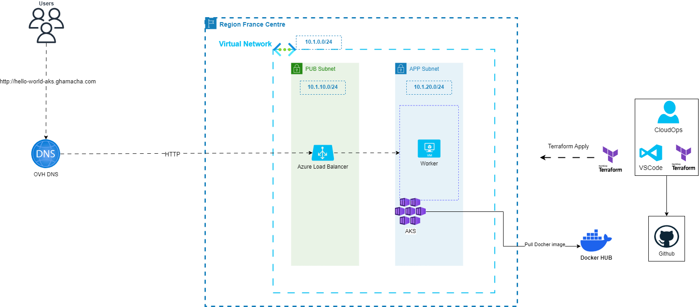

# AKS Hello world repos

**hello-world-aks** repository contains the source code to deploy aks with hello world on AKS

### 0. Architecture 




### 1. Repository Structure 

    ├── .gitignore                          
    ├── readme.md                           <-- Discover the project
    ├── docker                              <-- Contains Docker files  
    ├── media                               <-- Diagrams, images ..
    │   ├── Archi.drawio
    │   └── Archi.drawio.png
    ├── k8s                                <-- Kubernetes manifests
    │   ├── hello.yaml
    │   └── ingress.yaml    
    ├── scripts                             <-- code for ARM , cloudformation, scripts ...
    │   └── terraform_state.ps1             <-- Powershell template to create tf remote state resources on Aure
    └── terraform                                                
        │       
        │   
        ├── modules                         <-- The place for Terraform modules
        │   └── azure                       <-- Azure modules
        │       └── vnet                    <-- Azure Virtual Network module
        │           ├── main.tf
        │           ├── variables.tf
        │           └── output.tf    
        │
        ├── backend.tf              
        ├── provider.tf
        ├── kubernetes.tf
        └── network.tf   

### 2. How to run this terraform Code on Windows 

Requirement : 

- Kubectl v 1.27
- Azure CLI + Account Azure
- Git
- Terraform 

    clone repository 

```
git clone htpps://github.com/fghamacha/hello-world-aks.git
```

Make sure to have [Azure CLI installed](https://learn.microsoft.com/en-us/cli/azure/install-azure-cli-windows?tabs=azure-cli) nad log into azure with the following command : 
```
az login
```

edit the content of scripts/terraform_state.ps1 to create Terraform state resources on Azure
Then run the powershell script

```
cd scripts
./terraform_state.ps1
```
    
edit the content of terraform/backend.tf to match your ps1 script content
customize the value of variables on terraform/terraform.tfvars to 


go to terraform directory

```
cd terraform

```


init the terraform directory 

```
terraform init
```

Validate the code 
```
terraform validate
```

plan the code 

```
terraform plan
```

apply the code

```
terraform apply
```

update the local kubeconfig file edit the value of resource-group and cluster name then run it 

```
az aks get-credentials --resource-group "hello-world-aks-rg" --name hello-world-aks
```

### 3. Deploy 

Build the docker image with
change fahmi75 by the name of your docker registry 
change hello-world-aks by the name of yout futur hello world 

```
docker login
docker build -t fahmi75/hello-world-aks:v1 ./docker
docker push fahmi75/hello-world-aks:v1 
```

Edit the value of  spec.containers.image in k8s/hello.yaml to match to your created docker image 
Apply deployment, create ingress :

```
kubectl apply -f k8s/hello.yaml
```

Edit the value of spec.rules.host in ingress.yaml to match your subdomain 

```
kubectl apply -f k8s/ingress.yaml
```
Retreive the ip address of the ingress. Redirect your subdomain to External IP Address of hello-world-aks

```
kubectl get svc
```

Now Access to the web app on http://hello-world-aks.ghamacha.com

### 5. Webography 

Terraform Azure module : 

https://registry.terraform.io/modules/Azure/vnet/azurerm/latest